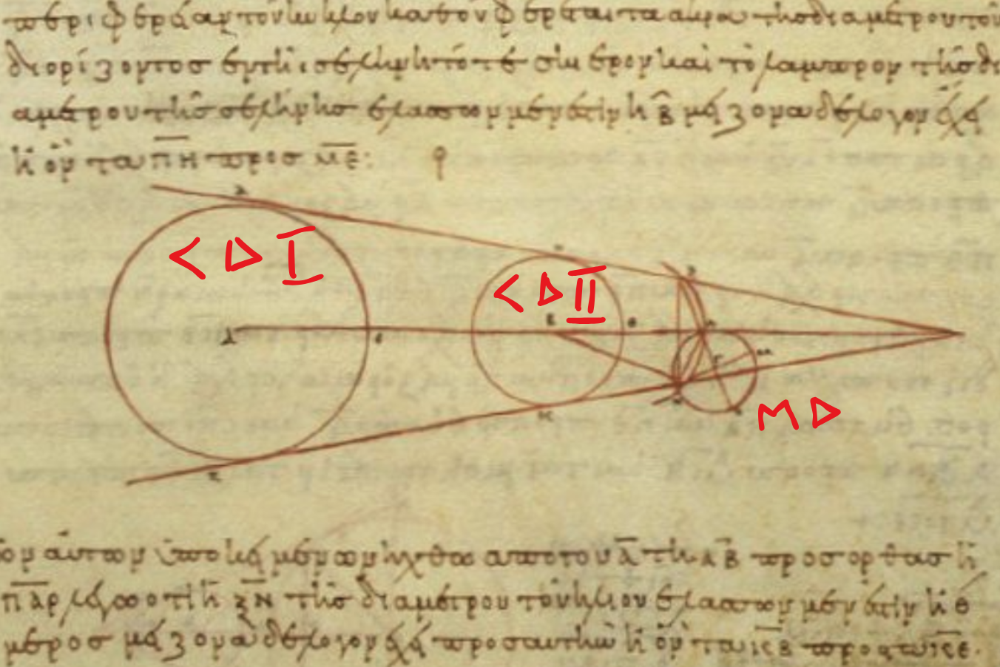

# Arystarch tool for WH mapping

<div style="text-align: center;">

</div>

A Python GUI tool for visualizing coordinate systems with obstacles and calculating paths between points while avoiding rectangular obstacles.

## Features

- Load coordinate data from JSON files;
- Visualize boundaries, rectangular obstacles, and points;
- ALL OBSTACLES HAVE NICE COLOURS;
- Calculate shortest paths between any two points avoiding obstacles;
- Visibility graph + Dijkstra's algorithm for pathfinding;
- Export all point-to-point path calculations to a txt\parquet\pickle files
- Async path calculations for responsive UI

## Requirements

- Python 3.10+
- tkinter (usually included with Python)

No external dependencies required - uses only Python standard library.

## Installation

```bash
git clone <repository-url>
cd arystarch_tool_kx

# Optional: create virtual environment
python -m venv .venv
source .venv/bin/activate  # Linux/Mac
# or: .venv\Scripts\activate  # Windows
```

## Usage

```bash
# Run with GUI file picker
python visualizer.py

# Or load a JSON file directly
python visualizer.py example_data.json
```

## JSON Format

```json
{
  "corners": [
    {"x": 0, "y": 0, "label": "Origin"},
    {"x": 100, "y": 100, "label": "Max"}
  ],
  "squares": [
    {
      "label": "Obstacle A",
      "corners": [
        {"x": 10, "y": 10},
        {"x": 30, "y": 40}
      ]
    }
  ],
  "points": [
    {"x": 5, "y": 5, "label": "P1"},
    {"x": 95, "y": 95, "label": "P2"}
  ]
}
```

- `corners`: Main boundary (2 diagonal points or 4 corner points)
- `squares`: List of rectangular obstacles (2 or 4 corner points each)
- `points`: List of points for pathfinding

## Project Structure

```
arystarch_tool_kx/
├── visualizer.py       # Main GUI application
├── src/
│   ├── __init__.py
│   ├── point.py        # Point dataclass
│   ├── rectangle.py    # Rectangle dataclass
│   ├── geo_helpers.py  # Geometry functions
│   └── pathfinding.py  # Pathfinding algorithms
├── example_data.json   # Sample data
├── requirements.txt
└── README.md
```

## Controls

- **File > Open JSON**: Load a coordinate file
- **From/To dropdowns**: Select start and end points
- **Export All Paths**: Generate a text report with all point-to-point distances